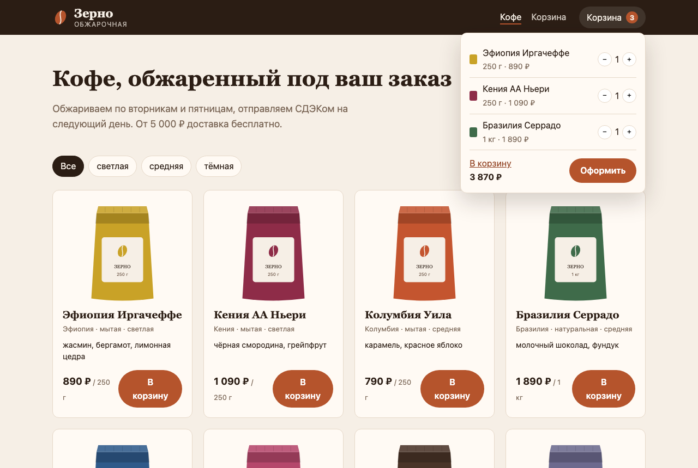
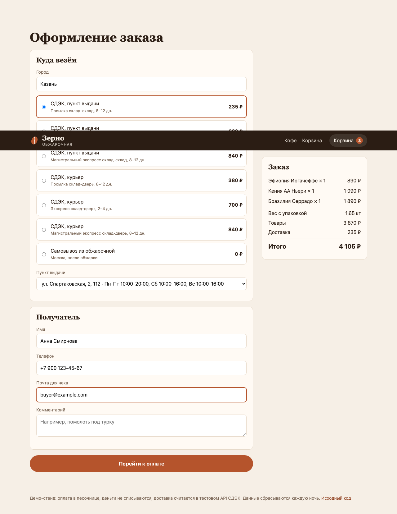
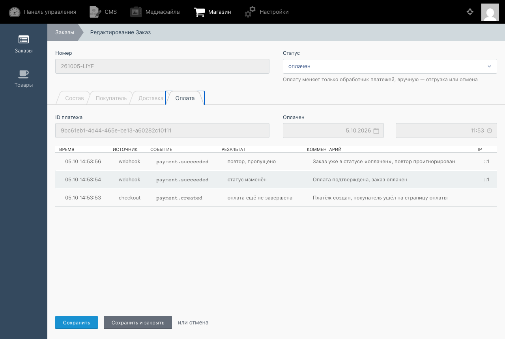

# Зерно — магазин обжарщика кофе на October CMS

Учебный интернет-магазин на October CMS 1.0 и Laravel 5.5: каталог, корзина на October AJAX, мини-корзина на React, оплата по схеме ЮKassa с вебхуками и доставка СДЭК через их тестовый API.

Стенд: https://z1nex.online/shop/ (оплата идёт через встроенную песочницу, деньги не списываются; база сбрасывается каждую ночь)



## Что умеет

- Корзина живёт в сессии и обновляется через October AJAX (`data-request`, partial-апдейты). Мини-корзина в шапке — отдельный React-бандл, который получает обновления через jQuery-событие `cart:changed` после каждого AJAX-запроса.
- Доставка считается в СДЭК API v2: подсказки городов, тарифы «склад-склад» и «склад-дверь» по весу корзины, список пунктов выдачи. Пересчёт сбрасывается при каждом изменении корзины, от 5000 ₽ доставка бесплатная.
- Оплата устроена как у ЮKassa: создаём платёж с ключом идемпотентности, уводим покупателя на страницу оплаты, ждём вебхук. Тело вебхука не принимается на веру — статус и сумма каждый раз перезапрашиваются у платёжного шлюза.
- Повторный вебхук не меняет заказ, он только попадает в журнал с пометкой «повтор, пропущено». Оплата, пришедшая после отмены, и расхождение суммы отклоняются.
- Если вебхук потерялся, раз в 5 минут `shop:reconcile-payments` сверяет висящие заказы со шлюзом, а через час без оплаты отменяет их.
- В бэкенде October — список заказов со статусами, журнал всех платёжных уведомлений по заказу и управление товарами с сортировкой.

| Оформление | Журнал оплаты в бэкенде |
|---|---|
|  |  |

## Как устроено

Вся логика — в плагине `plugins/z1nex/shop`, тема — `themes/coffee`.

- `classes/payments/PaymentProcessor.php` — единственное место, где меняется статус заказа. Обработка идёт в транзакции с `lockForUpdate`, поэтому два одновременных вебхука не оплатят заказ дважды. Возвращает `applied`, `duplicate`, `pending` или `rejected`, и всё это пишется в журнал `PaymentEvent`.
- `classes/payments/Gateway.php` — интерфейс шлюза. `YooKassaGateway` ходит в настоящий API ЮKassa, `SandboxGateway` хранит платежи у себя и показывает страницу оплаты с кнопками «Оплатить» и «Отменить». Драйвер выбирается переменной `SHOP_PAYMENT_DRIVER`.
- `routes.php` — приём вебхука. Для боевого драйвера пропускаются только IP-адреса ЮKassa из их документации.
- `classes/delivery/CdekClient.php` — OAuth-токен, расчёт тарифов и пункты выдачи. Токен и тарифы кэшируются; если СДЭК не ответил, покупатель видит запасные тарифы с пометкой, а оформление не ломается.
- `gulpfile.js` собирает SCSS, обычный JS на jQuery и через esbuild — React-мини-корзину.

Версии специально старые — October 1.0.476, Laravel 5.5, PHP 7.4: это тот стек, который до сих пор живёт на многих магазинах, и проект сделан, чтобы показать работу именно с ним.

## Запуск

Нужны PHP 7.4 с `pdo_sqlite`, `gd` и `zip`, Composer и Node.js 18+.

```bash
cp .env.example .env
composer install
php artisan key:generate
touch storage/database.sqlite
php artisan october:up
php artisan october:passwd admin <пароль>
npm ci
npx gulp build
php artisan serve --port=8080
```

Магазин откроется на http://localhost:8080, бэкенд — на /backend. В `.env.example` уже лежат публичные тестовые ключи СДЭК из их документации, так что доставка считается сразу.

Через Docker то же самое одной командой, магазин будет на http://localhost:8080/shop/, а пароль администратора появится в логе контейнера:

```bash
docker compose up -d --build
```

Тесты платёжной логики (вебхуки, повторы, подмена суммы, оплата после отмены):

```bash
php vendor/bin/phpunit -c plugins/z1nex/shop/phpunit.xml
```

## Стенд

Контейнер из `Dockerfile` стоит за Caddy на подпути `/shop/`. Бэкенд на стенде закрыт на уровне Caddy. В контейнере каждую минуту работает `schedule:run`: сверка платежей и ночной сброс демо-данных (`SHOP_DEMO_RESET=true`).

## Лицензия

MIT
